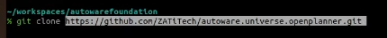
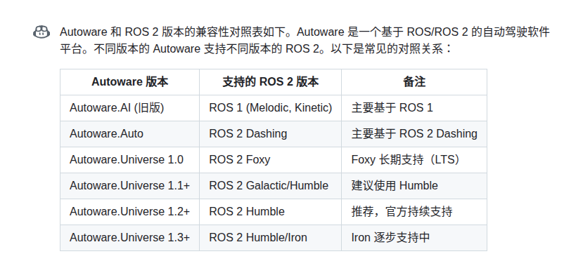

图像中的文字是：

```
github.com/ZATiTech/autoware.universe.openplanner.git
```



https://github.com/autowarefoundation/autoware.git

mkdir -p ./autoware-universe/src
cd ~/autoware-universe
git clone https://github.com/autowarefoundation/autoware.git src/autoware


git@github.com:autowarefoundation/autoware.git

git@github.com:ZATiTech/autoware.universe.openplanner.git



vcs import src < autoware.repos

`source /opt/ros/galactic/setup.bash`  
rosdep install -y --from-paths src --ignore-src --rosdistro foxy


