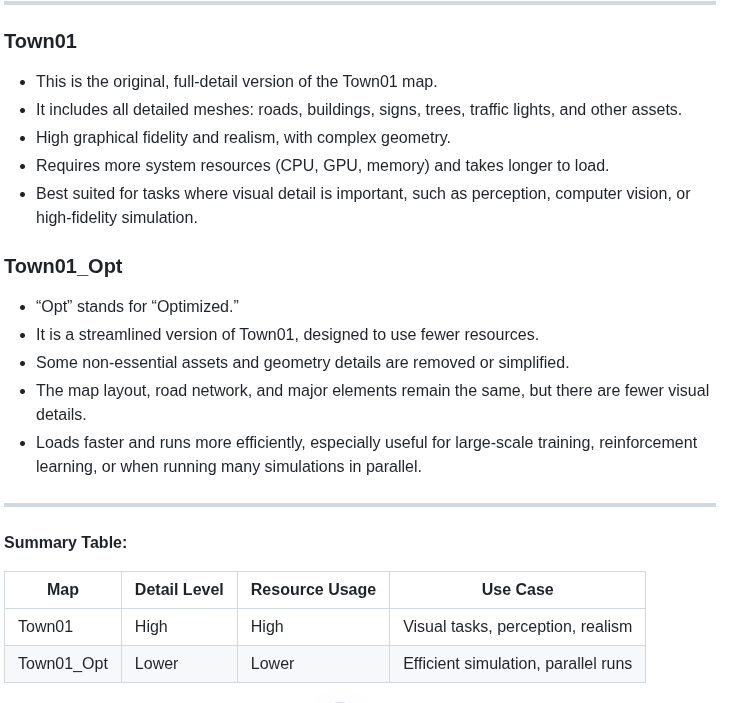

1 start carla server

/home/kotei/huqianqian/git_coding/program

2 query the map set and predefined weather set

(carla) kotei@kotei:~/huqianqian/software/CARLA_0.9.13/PythonAPI/util$ python ./config.py --list
weather presets:

    ClearNight, ClearNoon, ClearSunset, CloudyNight, CloudyNoon,
    CloudySunset, Default, HardRainNight, HardRainNoon,
    HardRainSunset, MidRainSunset, MidRainyNight, MidRainyNoon,
    SoftRainNight, SoftRainNoon, SoftRainSunset, WetCloudyNight,
    WetCloudyNoon, WetCloudySunset, WetNight, WetNoon, WetSunset.

available maps:

    Town01, Town01_Opt, Town02, Town02_Opt, Town03, Town03_Opt,
    Town04, Town04_Opt, Town05, Town05_Opt, Town06, Town06_Opt,
    Town07, Town07_Opt, Town10HD, Town10HD_Opt, Town11/Town11.

In CARLA, what is the difference between Town01 and Town01_Opt?

3 change the map

~/huqianqian/software/CARLA_0.9.13/PythonAPI/util

python ./config.py -m Town02

4 change the weather

  --weather WEATHER     set weather preset, use --list to see available presets

./config.py --weather SoftRainSunset

5 load a xodr file

  -x XODR_FILE_PATH, --xodr-path XODR_FILE_PATH
                        load a new map with a minimum physical road representation of the provided OpenDRIVE

./config.py --xodr-path /home/kotei/huqianqian/work_log/0703_Carla/0312_OpenDrive/whu_xodr/NOA_CITYWAY_V3.0/NOA_CITYWAY_V3.0.xodr

https://odrviewer.io

6 load a osm file
  --osm-path OSM_FILE_PATH
                        load a new map with a minimum physical road representation of the provided OpenStreetMaps
./config.py --osm-path /home/kotei/huqianqian/software/CARLA_0.9.13/carla_20251001/qgis/map.osm

