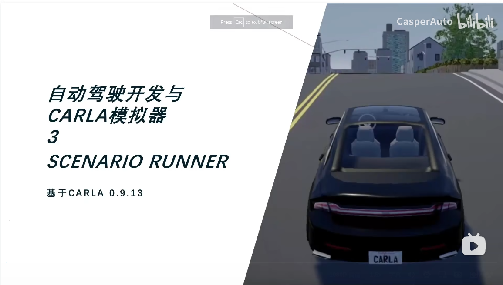
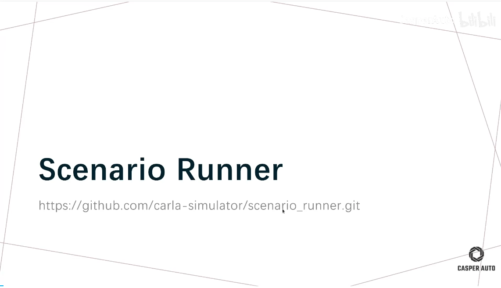
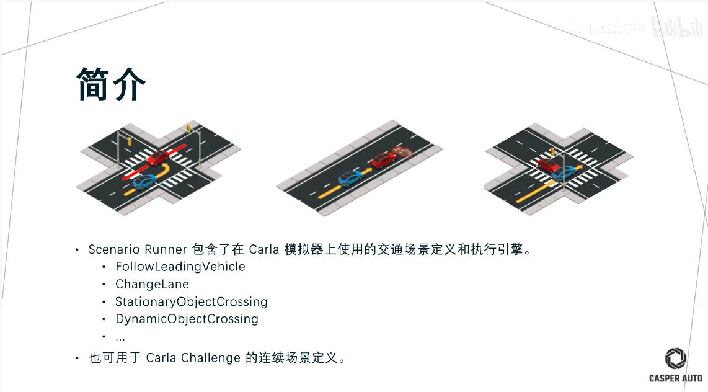
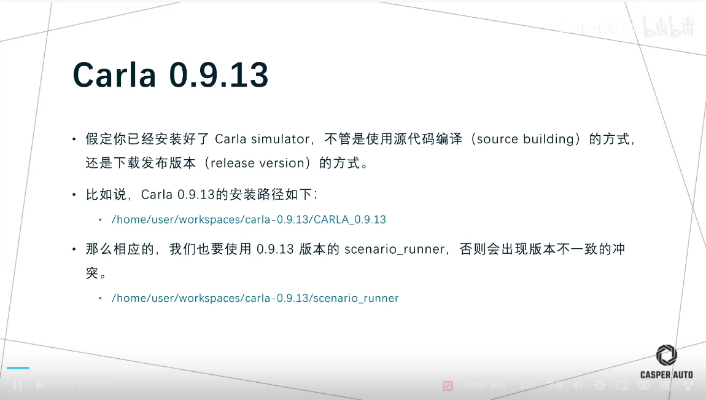
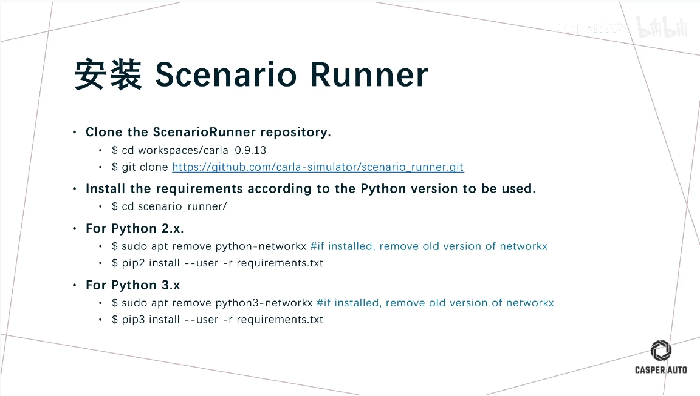
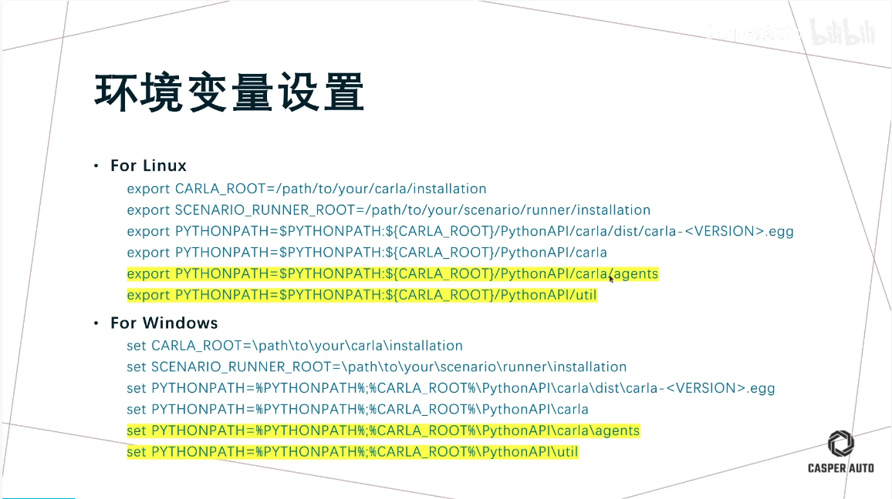
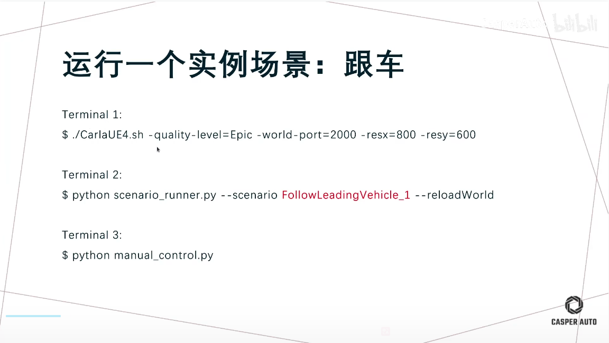
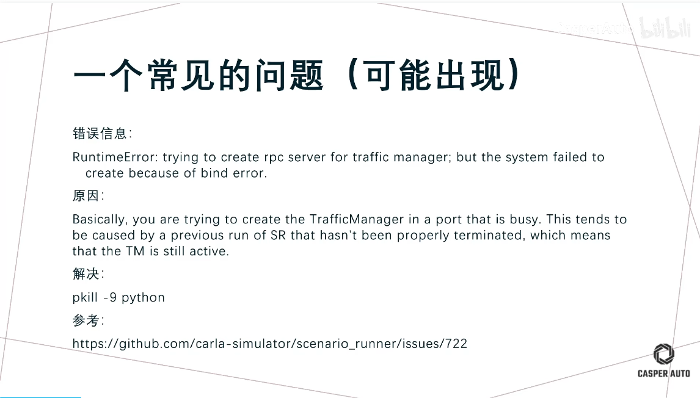
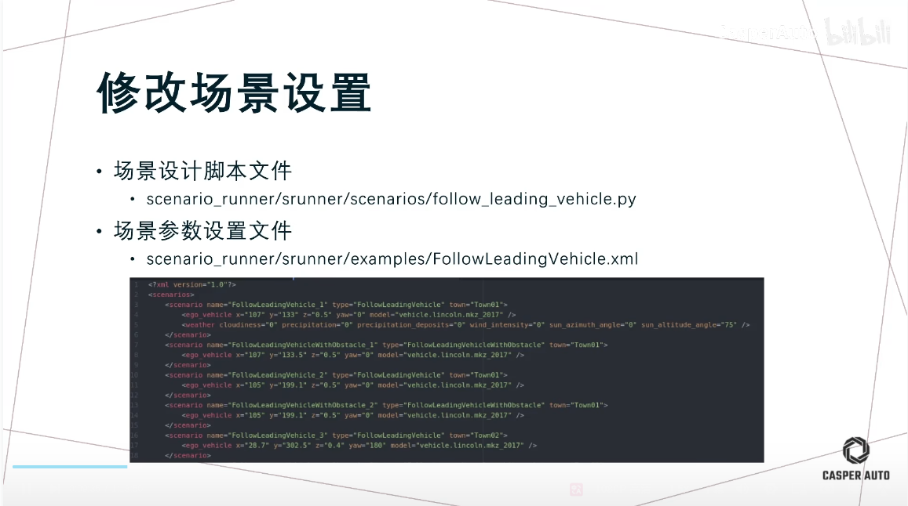
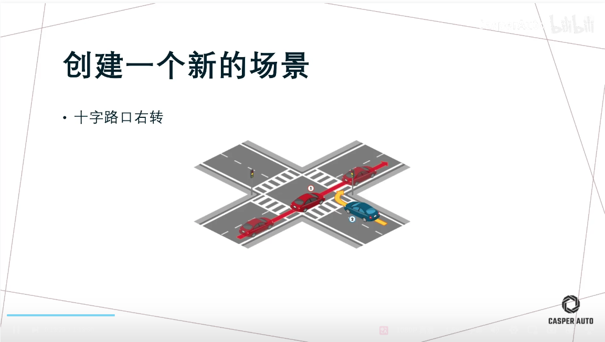

1 check the carla_scenario_runner version 
/home/kotei/huqianqian/software/CARLA_0.9.13/scenario_runner-0.9.13/scenario_runner.py
./scenario_runner.py -v

./scenario_runner.py --list

2 scenario test

FollowLeadingVehicleWithObstacle_1

2.1 config the map
./CarlaUE4.sh -carla-map=Town01

./scenario_runner.py --scenario FollowLeadingVehicle_1 

PythonAPI/util/config.py -m Town01

2.2  execute the scenario

./scenario_runner.py --scenario FollowLeadingVehicle_1 --output

2.3 use the manual car to test

    scenario_runner-0.9.13/manual_control.py 

CutInFrom_left_Lane
DynamicObjectCrossing_8

VehicleTurningLeft_2
VehicleTurningRight_3

./scenario_runner.py --scenario VehicleTurningRight_4 --output --repetitions 2

VehicleTurningRight_4
VehicleTurningLeft_4
VehicleTurningRight_5
VehicleTurningLeft_5
VehicleTurningRight_6
VehicleTurningLeft_6
VehicleTurningRight_7
VehicleTurningLeft_7
VehicleTurningRight_8
VehicleTurningLeft_8
NoSignalJunctionCrossing
FollowLeadingVehicle_1
FollowLeadingVehicleWithObstacle_1
FollowLeadingVehicle_2
FollowLeadingVehicleWithObstacle_2
FollowLeadingVehicle_3
FollowLeadingVehicleWithObstacle_3
FollowLeadingVehicle_4
FollowLeadingVehicleWithObstacle_4
FollowLeadingVehicle_5
FollowLeadingVehicleWithObstacle_5
FollowLeadingVehicle_6
FollowLeadingVehicleWithObstacle_6
FollowLeadingVehicle_7
FollowLeadingVehicleWithObstacle_7
FollowLeadingVehicle_8
FollowLeadingVehicleWithObstacle_8
FollowLeadingVehicle_9
FollowLeadingVehicleWithObstacle_9
FollowLeadingVehicle_10
FollowLeadingVehicleWithObstacle_10

ManeuverOppositeDirection_1
ManeuverOppositeDirection_2
ManeuverOppositeDirection_3
ManeuverOppositeDirection_4
SignalizedJunctionLeftTurn_1
SignalizedJunctionLeftTurn_2
SignalizedJunctionLeftTurn_3
SignalizedJunctionLeftTurn_4
SignalizedJunctionLeftTurn_5
SignalizedJunctionLeftTurn_6
CutInFrom_left_Lane
CutInFrom_right_Lane
SignalizedJunctionRightTurn_1
SignalizedJunctionRightTurn_2
SignalizedJunctionRightTurn_3
SignalizedJunctionRightTurn_4
SignalizedJunctionRightTurn_5
SignalizedJunctionRightTurn_6
SignalizedJunctionRightTurn_7

