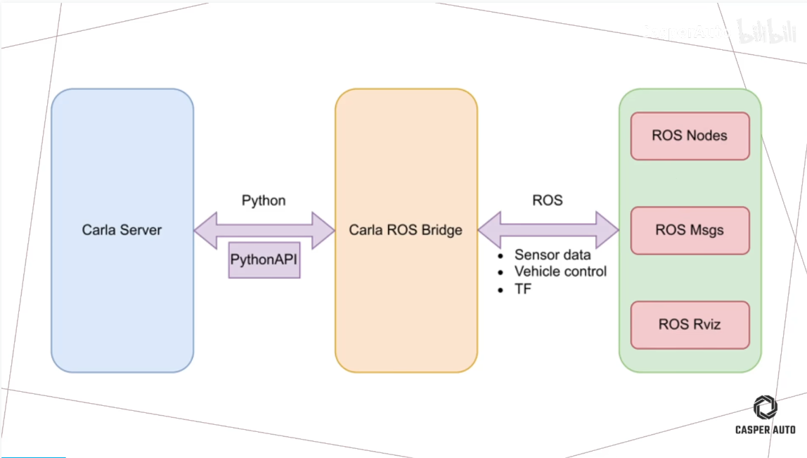
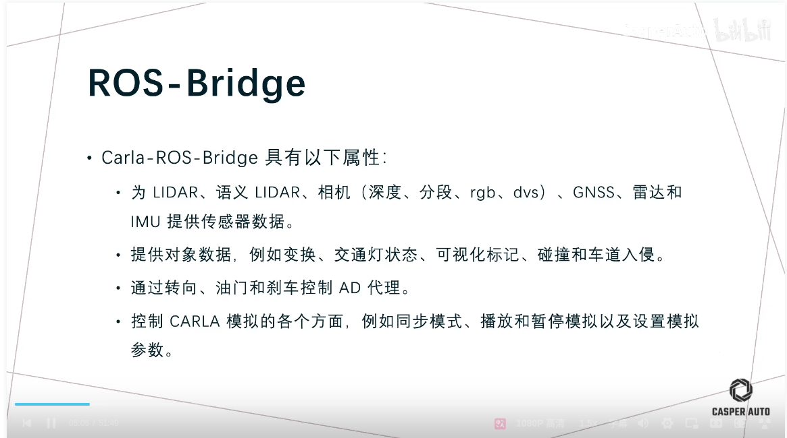
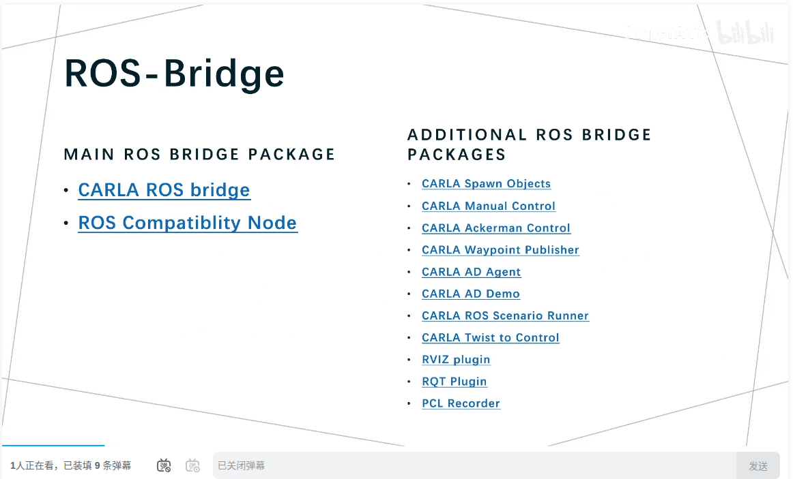
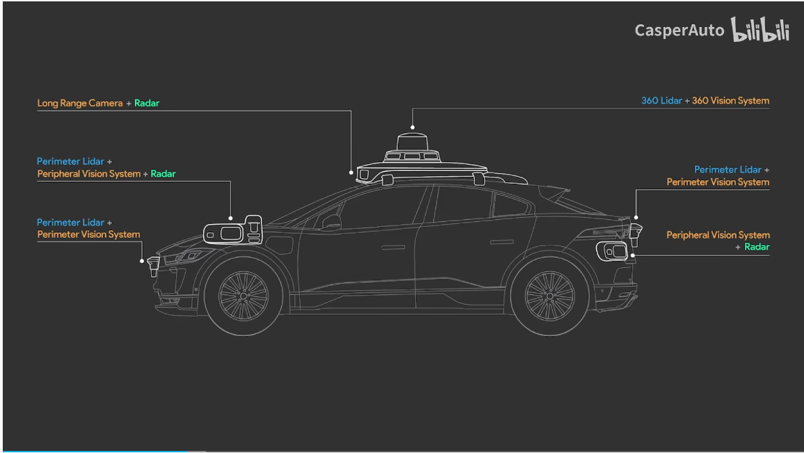
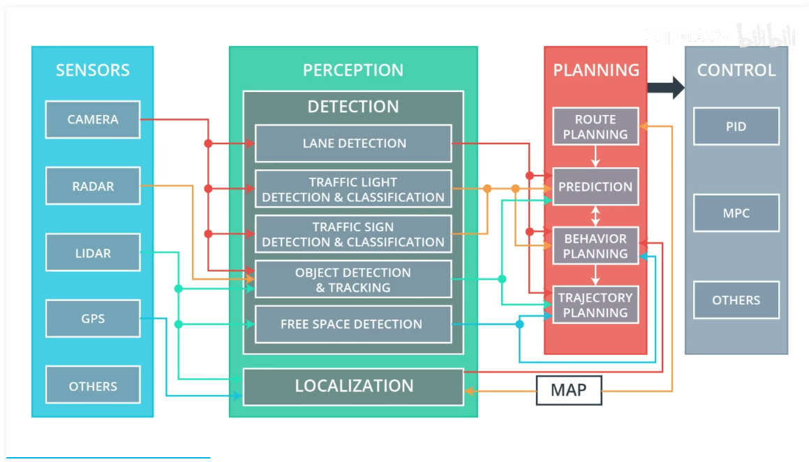
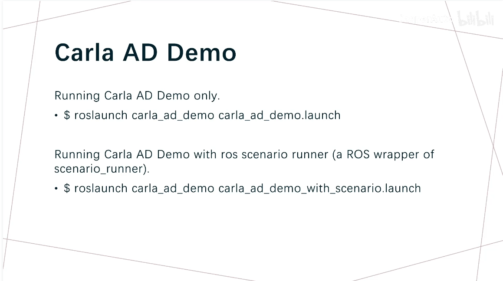
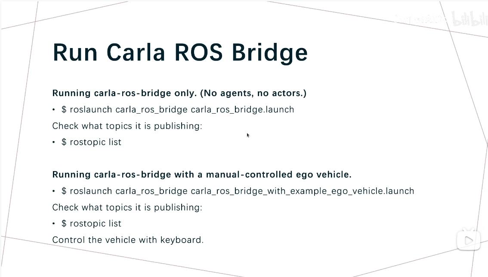
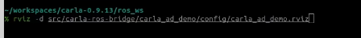
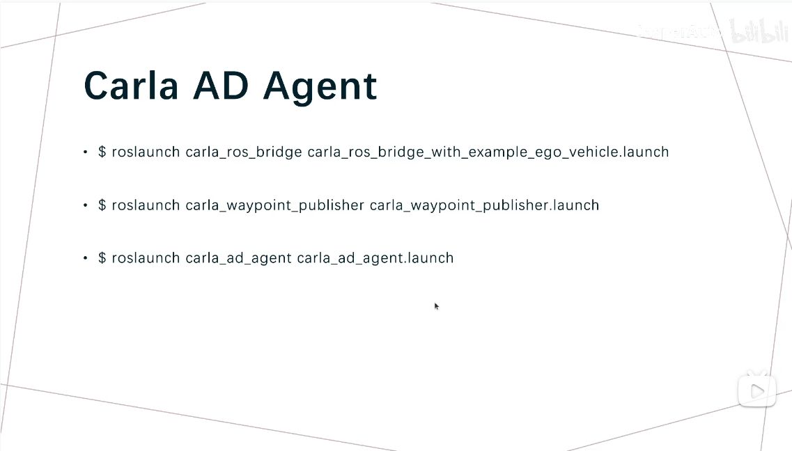
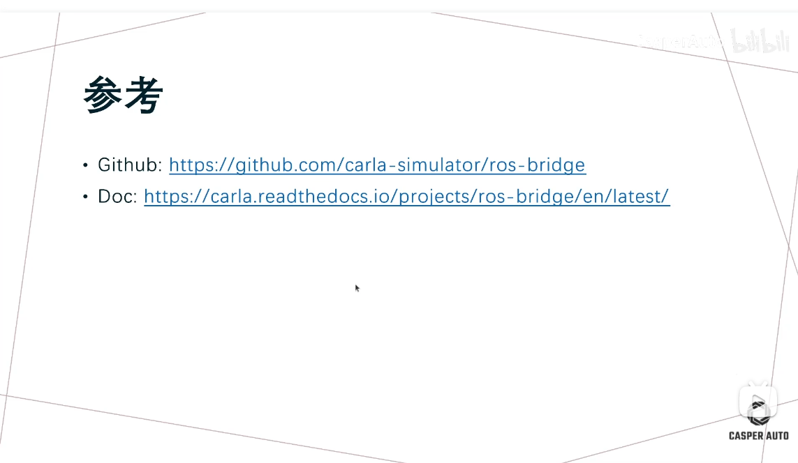

1 ros-bridge
connect carla and bridge, by ros message

directory:

/home/kotei/huqianqian/software/CARLA_0.9.13/carla_ros_bridge/src/ros-bridge

sensor data

ad agent

- Carla Spawn Objects: create ojbect and actor
- Carla Manual Contol
- Carla Ackerman Control
- Carla Waypoint Publisher
- Carla AD Agent
- Carla Ad Demo
- Carla ROS Scenario Runner
- Carla Twist to Control
- RVIZ plugin
- RQT Plugin
- PCL Recorder
  
  

  

  
  roslaunch carla_ad_demo carla_ad_demo.launch

in ros2 environment
  ros2 launch carla_ad_demo carla_ad_demo.launch

3 show all the package in the ros2
  ros2 pkg list 

4 start rviz2 
  ros2 run rviz2 rviz2

ros2 run rviz2 rviz2 -d /home/kotei/huqianqian/software/CARLA_0.9.13/carla_ros_bridge/src/ros-bridge/carla_ad_demo/config/carla_ad_demo_ros2.rviz 

notice: config the rviz2 config file

ros2 launch 

ros2 launch carla_waypoint_publisher carla_waypoint_publisher.launch.py 

ros2 launch carla_ad_agent carla_ad_agent.launch.py

ros2 run with scenario_runner

check the carla topic info

ros2 topic echo /carla/ego_vehicle/vehicle_info
ros2 topic info /carla/ego_vehicle/vehicle_info

2 in the carla_ros_bridge folder, you can change and config the sensor by the config file

/home/kotei/huqianqian/software/CARLA_0.9.13/carla_ros_bridge/src/ros-bridge/carla_spawn_objects/config/objects.json

3 you can see the calra message type info 
/home/kotei/huqianqian/software/CARLA_0.9.13/carla_ros_bridge/src/ros-bridge/carla_msgs/msg/CarlaActorInfo.msg

4 publish a path

ros2 launch carla_waypoint_publisher carla_waypoint_publisher.launch.py 

/home/kotei/huqianqian/software/CARLA_0.9.13/carla_ros_bridge/src/ros-bridge/carla_waypoint_publisher

5 execute carla adAgent
ros2 launch carla_ad_agent  carla_ad_agent.launch.py 

  <!-- Publish the target speed -->
  <node pkg="rostopic" type="rostopic" name="rostopic" args="pub /carla/$(arg role_name)/target_speed std_msgs/Float64 $(arg target_speed)"/>

ros2 topic pub /carla/ego_vehicle/target_speed std_msgs/msg/Float64 "{data: 10.0}"
