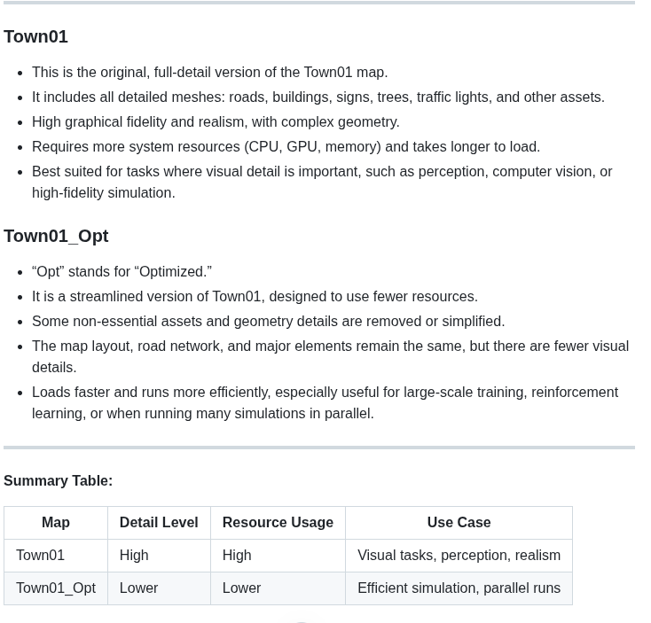
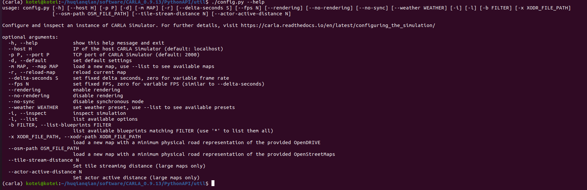

# CARLA Map and Weather Configuration / CARLAマップと天気設定

This case can change the map and weather in the carla environment.  
このケースでは、CARLA環境でマップと天気を変更できます。

## 1. Start CARLA Server / CARLAサーバーを開始

/home/kotei/huqianqian/git_coding/program

## 2. Query the map set and predefined weather set / マップセットと事前定義された天気セットを照会

(carla) kotei@kotei:~/huqianqian/software/CARLA_0.9.13/PythonAPI/util$ python ./config.py --list

**Weather presets / 天気プリセット:**

    ClearNight, ClearNoon, ClearSunset, CloudyNight, CloudyNoon,
    CloudySunset, Default, HardRainNight, HardRainNoon,
    HardRainSunset, MidRainSunset, MidRainyNight, MidRainyNoon,
    SoftRainNight, SoftRainNoon, SoftRainSunset, WetCloudyNight,
    WetCloudyNoon, WetCloudySunset, WetNight, WetNoon, WetSunset.

**Available maps / 利用可能なマップ:**

    Town01, Town01_Opt, Town02, Town02_Opt, Town03, Town03_Opt,
    Town04, Town04_Opt, Town05, Town05_Opt, Town06, Town06_Opt,
    Town07, Town07_Opt, Town10HD, Town10HD_Opt, Town11/Town11.

In CARLA, what is the difference between Town01 and Town01_Opt?  
CARLAでは、Town01とTown01_Optの違いは何ですか？

## 3. Change the map / マップを変更

~/huqianqian/software/CARLA_0.9.13/PythonAPI/util

python ./config.py -m Town02

## 4. Change the weather / 天気を変更

  --weather WEATHER     set weather preset, use --list to see available presets  
                        天気プリセットを設定、利用可能なプリセットを確認するには --list を使用

./config.py --weather SoftRainSunset

## 5. Load a xodr file / xodrファイルを読み込み

  -x XODR_FILE_PATH, --xodr-path XODR_FILE_PATH
                        load a new map with a minimum physical road representation of the provided OpenDRIVE  
                        提供されたOpenDRIVEの最小物理道路表現で新しいマップを読み込み

./config.py --xodr-path /home/kotei/huqianqian/work_log/0703_Carla/0312_OpenDrive/whu_xodr/NOA_CITYWAY_V3.0/NOA_CITYWAY_V3.0.xodr

https://odrviewer.io

## 6. Load a osm file / osmファイルを読み込み

  --osm-path OSM_FILE_PATH
                        load a new map with a minimum physical road representation of the provided OpenStreetMaps  
                        提供されたOpenStreetMapsの最小物理道路表現で新しいマップを読み込み

./config.py --osm-path /home/kotei/huqianqian/software/CARLA_0.9.13/carla_20251001/qgis/map.osm

